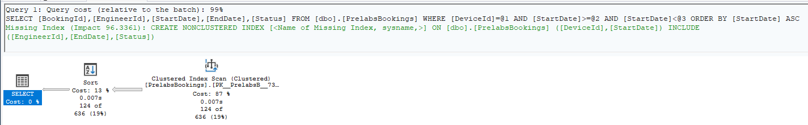
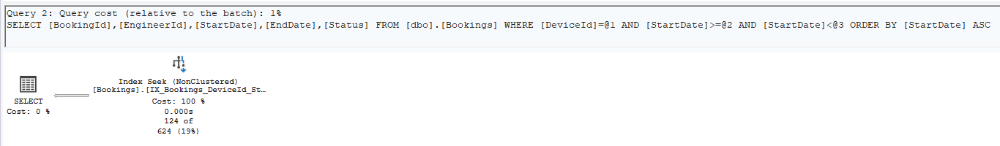
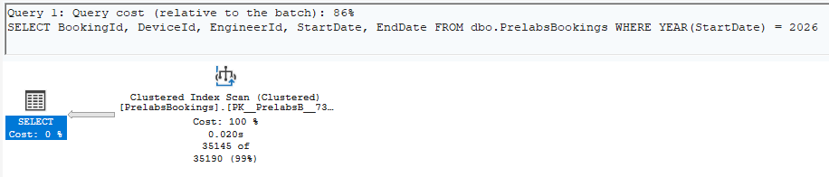
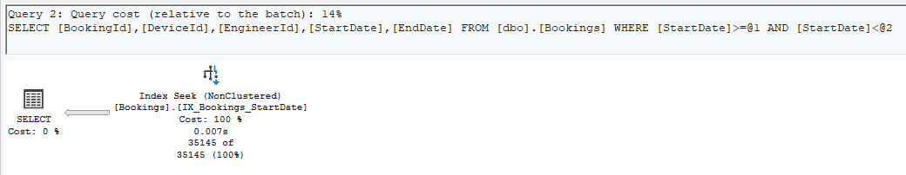
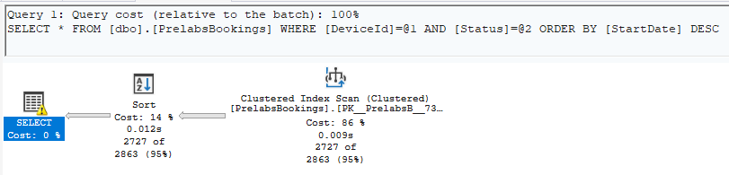
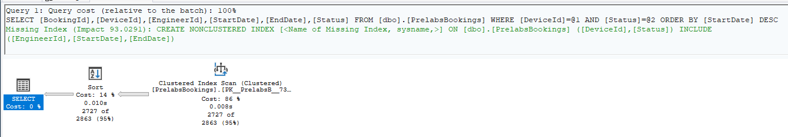
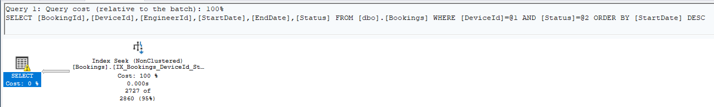
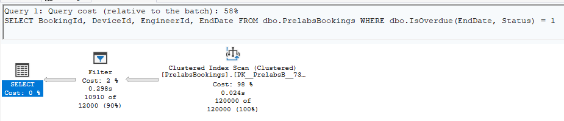
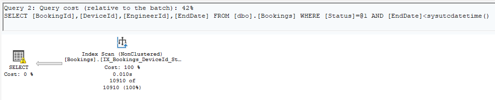

# SQL Performance Diagnosis Lab

**Lab:** Day 4 — SQL Performance Diagnosis Lab (Plans, Indexes, Trade-offs)  
**References:** [Microsoft Learn - SQL Server Indexes Documentation](https://learn.microsoft.com/en-us/sql/relational-databases/indexes/indexes), [Microsoft Learn - Index architecture and design guide](https://learn.microsoft.com/en-us/sql/relational-databases/sql-server-index-design-guide?view=sql-server-ver17)

---

## Q1: Device Bookings for the Quarter

### 1. Query
```sql
SELECT BookingId, EngineerId, StartDate, EndDate, Status
FROM dbo.Bookings
WHERE DeviceId = 17
  AND StartDate >= '2026-07-01' AND StartDate < '2026-10-01'
ORDER BY StartDate;
```

### 2. Diagnosis
#### Problem: 
`dbo.Bookings` currently only has a primary key clustered index on `BookingId`. There are no secondary non-clustered indexes on `DeviceId` or `StartDate`.

#### Why does it get slower as the `Bookings` table grow?
  1. As mentioned in [MS Learn: Clustered and Nonclustered Indexes Described](https://learn.microsoft.com/en-us/sql/relational-databases/indexes/clustered-and-nonclustered-indexes-described), a table without an index supporting the search predicate forces SQL Server to perform a full **Clustered Index Scan**. Which means every single data page of `dbo.Bookings` (which has ~120,000 rows) must be loaded into the memory and scanned, resulting in O(N) disk/buffer pool I/O operations.
  2. The scanned rows are also not pre-sorted by `StartDate`. Therefore, the query engine must explicitly introduce a **Sort** operator in memory/tempdb to process `ORDER BY StartDate`, which would also add more CPU and memory overhead.

### 3. Execution Plan (Before and After)

**Before tuning:**


*Figure 1.1: Q1 Baseline Sort & Clustered Index Scan*

**After tuning:**


*Figure 1.2: Q1 Tuned Nonclustered Index Seek*

### 4. Fix: Nonclustered *Covering* Index

As mentioned in [MS Learn: Create Indexes with Included Columns](https://learn.microsoft.com/en-us/sql/relational-databases/indexes/create-indexes-with-included-columns):

> *"An index with nonkey columns can significantly improve query performance when all columns in the query are included in the index either as key or nonkey columns. Performance gains are achieved because the query optimizer can locate all the column values within the index; table or clustered index data isn't accessed resulting in fewer disk I/O operations."*

The fix was to create a composite nonclustered index on `(DeviceId, StartDate)` with `(EngineerId, EndDate, Status)` included as nonkey columns:

```sql
CREATE NONCLUSTERED INDEX IX_Bookings_DeviceId_StartDate
ON dbo.Bookings (DeviceId, StartDate)
INCLUDE (EngineerId, EndDate, Status);
```

The index design followed here (and for the indexes created in the next questions) is entirely based off of the [MS Learn Index Design Guide](https://learn.microsoft.com/en-us/sql/relational-databases/sql-server-index-design-guide):

- **Leading Key Column (`DeviceId`):** Matches the equality operator (`DeviceId = 17`). Putting equality predicate columns first allows B+ tree traversal to perform an immediate **Index Seek**.
- **Second Key Column (`StartDate`):** Matches the range predicate (`>=` and `<`) AND satisfies `ORDER BY StartDate` naturally in B-tree key order, eliminating the explicit Sort operator entirely as seen in the tuned execution plan earlier.
- **`INCLUDE` Nonkey Columns (`EngineerId, EndDate, Status`):** Keeps the index key size small while also making the index a **covering index**. Qouted again from MS Notes:
  > *"Redesign nonclustered indexes that have a large index key size so that only columns used for searching and lookups are key columns. Make all other columns that cover the query into nonkey columns."*

---

## Q2: Bookings Started in 2026

### 1. Query
```sql
SELECT BookingId, DeviceId, EngineerId, StartDate, EndDate
FROM dbo.Bookings
WHERE YEAR(StartDate) = 2026;
```

### 2. Diagnosis
#### Problem
Wrapping `StartDate` in the T-SQL function `YEAR()` makes the predicate **non-sargable** (standing for *Search ARGument ABLE*).

#### Why an index won't work for the current query:
It wouldn't work because `YEAR(StartDate)` wraps the column in a scalar function, and since a potential index on `StartDate` would store and sort B+ tree keys by raw datetime values (`2026-01-01 06:00:00`) and not by the computed output of `YEAR()`, SQL Server won't be able to calculate in advance where the matching 2026 rows are within the sorted B+ tree structure.

To evaluate `YEAR(StartDate) = 2026`, SQL Server cannot perform an **Index Seek** and is forced to scan every single row in the table to run the function row-by-row. Per [MS Learn: Index Architecture Guide](https://learn.microsoft.com/en-us/sql/relational-databases/sql-server-index-design-guide), applying functions to index key columns prevents Search Argument (SARGable) optimization.

### 3. Execution Plan (Before and After)

**Before tuning:**


*Figure 2.1: Q2 Non-SARGable Clustered Index Scan*

**After tuning:**


*Figure 2.2: Q2 SARGable Nonclustered Index Seek*

### 4. Fix: SARGable Query Rewrite and Index
The fix was to rewrite the `WHERE` clause to filter on the bare column using date range (`>=` and `<`) instead of relying on `YEAR()`:

```sql
-- SARGable Query Rewrite
SELECT BookingId, DeviceId, EngineerId, StartDate, EndDate
FROM dbo.Bookings
WHERE StartDate >= '2026-01-01' AND StartDate < '2027-01-01';

-- Also included a supporting Index
CREATE NONCLUSTERED INDEX IX_Bookings_StartDate
ON dbo.Bookings (StartDate)
INCLUDE (DeviceId, EngineerId, EndDate);
```

Now that `StartDate` is unwrapped, SQL Server can perform an **Index Seek** directly to `'2026-01-01'` and range-scan only 2026 data pages.

---

## Q3: Dashboard Grid Queries

### 1. Query
```sql
SELECT *
FROM dbo.Bookings
WHERE DeviceId = 5 AND Status = 'returned'
ORDER BY StartDate DESC;
```

### 2. Diagnosis
#### Problem
`SELECT *` requests unneeded columns (`CreatedOn` and `Payload NVARCHAR(MAX)`). Since one of the unneeded columns is a large object, it prevents index coverage and it also inflates sort memory. 

### 3. Execution Plan (Before and After)

**Before tuning:**


*Figure 3.1: Q3 Baseline Sort and Clustered Index Scan*

**After removing SELECT * (without Q1 index)**


*Figure 3.2: Q3 Semi-tuned Sort and Clustered Index Scan*

**After removing SELECT * (with Q1 index):**


*Figure 3.3: Q3 Tuned Nonclustered Index Seek*

### 4. Primary Fix
Drop `SELECT *` and project only the required columns:

```sql
-- Code Fix
SELECT BookingId, DeviceId, EngineerId, StartDate, EndDate, Status
FROM dbo.Bookings
WHERE DeviceId = 5 AND Status = 'returned'
ORDER BY StartDate DESC;
```

We could also create an index, but the columns already match the Q1 index (`IX_Bookings_DeviceId_StartDate`), turning it into a **100% covering index** with 0 LOB reads, and 0 explicit sort cost.

---

## Q4: Overdue Bookings

### 1. Query
```sql
SELECT BookingId, DeviceId, EngineerId, EndDate
FROM dbo.Bookings
WHERE dbo.IsOverdue(EndDate, Status) = 1;
```

### 2. Diagnosis
#### Problem
`dbo.IsOverdue` is a **Scalar User-Defined Function (UDF)**. In our case, this function is iteratively executed row-by-row. This phenomenon is called **RBAR**. ([MS Learn: UDF Inlining](https://learn.microsoft.com/en-us/sql/relational-databases/user-defined-functions/scalar-udf-inlining)). Parallelism is also disabled since SQL Server does not allow intra-query parallelism in queries that invoke UDFs.

### 3. Execution Plan (Before and After)
- **Clustered Index Scan:** Reads all ~120,000 rows.
- **Filter Operator:** Appears cheap in plan diagram, masking 120,000 function executions.
- **Single-Threaded:** Forced DOP = 1.

**Before tuning:**


*Figure 4.1: Q4 Scalar UDF, Iterative Filter & Scan*

**After tuning**


*Figure 4.2: Q4 Inlined Filtered Index Seek*

### 4. Primary Fix
Instead of using the UDF, just inline the boolean expression directly into the `WHERE` clause and support with a **Filtered Index** ([MS Learn: Filtered Indexes](https://learn.microsoft.com/en-us/sql/relational-databases/indexes/create-filtered-indexes)): 

```sql
-- Inlined SARGable Query
SELECT BookingId, DeviceId, EngineerId, EndDate
FROM dbo.Bookings
WHERE Status = 'pickedup'
  AND EndDate < SYSUTCDATETIME();

-- Supporting Filtered Index
CREATE NONCLUSTERED INDEX IX_Bookings_PickedUp_Overdue
ON dbo.Bookings (EndDate)
INCLUDE (DeviceId, EngineerId)
WHERE Status = 'pickedup';
```

This works because it eliminates 120,000 UDF calls and the filtered index indexes only `'pickedup'` rows, allowing an **Index Seek** 

---

## Final Section: When is adding an index the WRONG fix?

As written in [MS Learn: Index Design Guide](https://learn.microsoft.com/en-us/sql/relational-databases/sql-server-index-design-guide), adding an index can often be the **wrong fix**, causing buffer pool bloat, write degradation, and index fragmentation without fixing the root query issue. Three potential cases:

1. **Non-SARGable query predicates (like in Q2):**
   - *Example:* Adding an index on `StartDate` for `WHERE YEAR(StartDate) = 2026`.
   - *Why it's wrong:* Scalar functions prevent B-tree seeks, forcing an Index Scan regardless of index availability. The query must be rewritten first (`WHERE StartDate >= ... AND StartDate < ...`) before even considering an index.

2. **`SELECT *` containing Wide LOBs (like in Q3):**
   - *Example:* Indexing `(DeviceId, Status)` while querying `SELECT *` over `Payload NVARCHAR(MAX)`.
   - *Why it's wrong:* Nonclustered indexes cannot cover wide LOB columns, triggering thousands of Key Lookups, it's basically rendered useless. Dropping `SELECT *` fixes performance instantly when used with indexes.

3. **Low Selectivity / High Density Columns:**
   - *Example:* Indexing low-selectivity columns like `Status` or boolean `IsActive` where queries return a small percentage of the table.
   - *Why it's wrong:* Random I/O from Key Lookups are actually more expensive than a sequential Clustered Index Scan. SQL Server will ignore the index entirely, wasting disk space and CPU. Use **Filtered Indexes** instead for these situations.